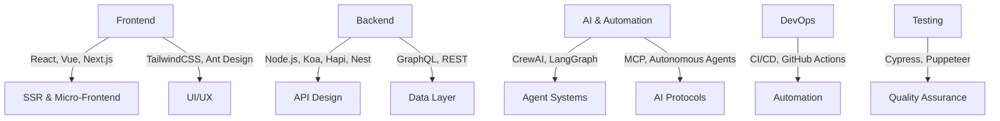

<h1 align="center">
  
  Hi, I'm davy 👋
</h1>

  
  
  
  
  
  
  

---

## 🚀 About Me

> 🧑‍💻 **Full-stack JS explorer** | 🦾 **AI Agent Builder** | 🎨 **Micro-frontend Architect**  
> Started as a frontend dev, but I've done pretty much everything JS-related.  
> Super into AI lately, diving deep into agent development.  
> Love leading small teams, but hands-on coding is still my thing.

---

## 🧠 Tech Stack & Skills

## 🤖 AI & Innovation

- 🧬 Building intelligent agent systems with CrewAI & LangGraph
- 🔗 Exploring Multi-Agent Conversation Protocol (MCP)
- 🧠 Always learning: latest AI, automation, and JS ecosystem

---

## 📈 GitHub Stats

  
  

---

## 🛠️ Toolbox

  

---

## 📬 Contact

- 💼 [LinkedIn](https://linkedin.com/in/chendawei)
- 📨 [Email](mailto:chendawei@gmail.com)
- 🏠 [Portfolio](https://chendawei.dev)

---

  
📝 TL;DR

  <ul>
    <li>9+ years in web dev, React/Next.js/Vue micro-frontends</li>
    <li>Node.js backend: Hapi, Koa, Nest, Fastify</li>
    <li>GraphQL, REST, API design & testing</li>
    <li>CI/CD, analytics, automation</li>
    <li>AI agent systems, CrewAI, LangGraph, MCP</li>
    <li>Agile, client communication, team leadership</li>
  </ul>

---

  
   
  <b>Always building. Always learning. 🚀</b>

