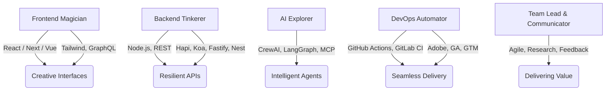

<!--
  Welcome to Davy's Corner: Where Code Meets Curiosity 🚀
-->

  
   

---

  
  
  
  
  

---

## 🦾 Worth Reading

> Started as a frontend dev, but I've done pretty much everything JS-related. Got tons of experience under my belt, but still hungry for more.  
> Super into AI lately, been diving deep into agent development courses.  
> Looking to pivot a bit in that direction.  
> Love staying hands-on with code, and I'm comfortable leading small teams, but coding is still my thing.

---

  
🔥 <b>TL;DR</b> (Expand for the Full Stack Story)

  **Technical Expertise:**  
  - 9+ years in web technologies, specializing in React, React Native, Vue.js  
  - Micro-frontend architecture & SSR with Next.js  
  - UI wizardry with TailwindCSS, data whisperer with GraphQL  

  **Backend & API:**  
  - Node.js (Hapi, Koa, Fastify, Nest)  
  - Robust RESTful APIs, strong testing for resilient services  

  **Quality Assurance & Testing:**  
  - Unit, integration & E2E tests (Puppeteer, Cypress)  
  - Strict code quality via linting & automation  

  **DevOps & Analytics:**  
  - CI/CD with GitHub Actions & GitLab CI  
  - User analytics: Adobe Analytics, GA, GTM  

  **Innovation & Growth:**  
  - AI & multi-agent systems (CrewAI, LangGraph, MCP)  
  - Building, automating, and always learning  

  **Project Management & Communication:**  
  - Agile, client comms, technical research  
  - Solution delivery & positive feedback

---

## 🎨 Tech Playground

---

## ⚡️ Creative Spark

- 🎭 **Micro-frontend Magician**: Modular, scalable, future-proof apps.
- 🧠 **AI Agent Architect**: Building CrewAI & LangGraph systems.  
- 📊 **Analytics Whisperer**: Transforming behavior data to insights.
- 🧪 **Test-driven Everything**: Bugs fear my CI/CD pipeline.
- 🌱 **Relentless Learner**: If it’s cutting-edge, I’m already tinkering.

---

## 🛠️ My Toolbox

  

---

## 🚦 Stats & Trophies

  
  
   
  

---

## 🌌 What’s Next?

- 🤖 Building LLM-powered multi-agent systems
- 🦾 Pushing micro-frontend boundaries
- 📡 Learning, automating, sharing

---

## 🤝 Connect with Me

 <!-- replace -->
 <!-- replace -->

---

  
   
  <b>“Stay curious. Code boldly. Automate wisely.”</b>

