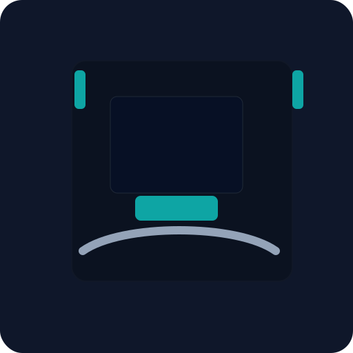
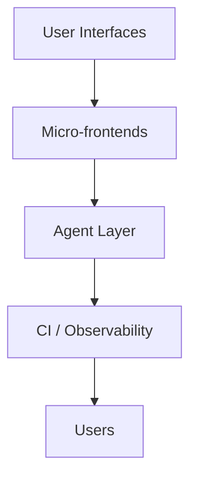

<!-- AI 修改: 本文件由 OpenCode AI（ChatGPT）协助优化，标记：AI 修改 -->

<!-- Centered header using a GitHub-compatible HTML image for consistent rendering -->

  

# Davy Chen — Code with Curiosity ✨

---

<!-- Badges -->

---

### Hello — I'm Davy 👋

I turn curiosity into reliable systems: snappy frontends, modular micro-frontends, and agent-led automations that help teams move faster. I care about performance, developer experience, and reproducible experiments.

<!-- Quick highlights + Tech icons -->
## Quick Highlights

- 🌐 9+ years building production web apps (React, Next.js, Vue)
- 🧩 Micro-frontend platforms & runtime composition
- 🤖 LLM agents, tool chains, and automation experiments
- 🧪 Engineering DX: testing, CI/CD, observability

### Principles

- Fast path first, safe path always
- Automate work that should not be manual
- Readable, testable code wins

*Exploring multi-agent orchestration, reproducible demos, and composable UX.*

---

## Featured Projects

The projects below are selected automatically by a small workflow (keywords: crewai, langgraph, microfront, agent, ai, llm). Trigger the workflow or let it run on schedule to populate.

<!-- REPO-LIST:START -->
_No projects found yet — trigger the GitHub Action to populate this list._
<!-- REPO-LIST:END -->

---

## Experiments & Notes

- 🧭 Agent orchestration patterns (crew, tool encapsulation)
- 🧩 Micro-frontend runtime composition experiments
- ⚡ Tiny reproducible demos and utilities

---

## Visual Playground

```mermaid
graph TD
  UI[User Interfaces] --> MF[Micro-frontends]
  MF --> Agent[Agent Layer]
  Agent --> Infra[CI / Observability]
  Infra --> Users
```

---

## Stats & Connect

  
  

    
    
  

---

  <strong style="color:#ff6b6b;">“Stay curious. Code boldly. Automate wisely.”</strong>
   
  <em>此 README 部分由自动化脚本维护 — AI 协助优化</em>

