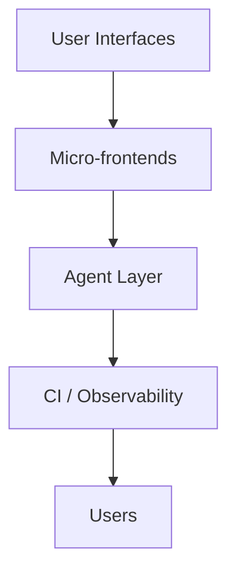

<!-- AI 修改: 本文件由 OpenCode AI（ChatGPT）协助优化，标记：AI 修改 -->

  
   
  <h1>Davy Chen — Code with Curiosity</h1>
  <em>Crafting fast frontends, modular platforms, and agent-led automations.</em>

---

  
  
  
  

---

Intro: I turn curiosity into reliable systems — elegant frontends, composable micro-frontends, and LLM-driven agents that automate meaningful work.

---

<!-- LAYOUT: two-column summary -->
<table width="100%">
  <tr>
    <td width="60%" valign="top">
      ### Quick Highlights
      - 9+ years building web products (React, Next.js, Vue)
      - Micro-frontend platforms, runtime composition, federated UX
      - Building and experimenting with LLM agents and tool chains
      - Strong on DX: testing, CI/CD, and observability

      ### Principles
      - Delight the fast path, safeguard the slow path
      - Automate repetitive work; empower human decisions
      - Readable, testable code > clever one-liners
    </td>
    <td width="40%" valign="top" align="center">
      
      
<small>Currently exploring multi-agent orchestration + reproducible experiments.</small>

    </td>
  </tr>
</table>

---

## Featured Projects

Below are a selection of repositories pulled automatically from my GitHub — the list updates via a scheduled GitHub Action. The action selects repos by keywords (crewai, langgraph, microfront, agent, ai, llm) or by popularity.

<!-- REPO-LIST:START -->
_No projects found yet — the README generator will populate this area. Trigger the action with the workflow dispatch or wait for the scheduled run._
<!-- REPO-LIST:END -->

---

## Experiments & Notes

- LLM agent patterns (crew orchestration, tool encapsulation)
- Micro-frontend runtime composition experiments
- Small utilities and reproducible demo apps

---

## Visual Playground

```mermaid
graph TD
  UI[User Interfaces] --> MF[Micro-frontends]
  MF --> Agent[Agent Layer]
  Agent --> Infra[CI / Observability]
  Infra --> Users
```

---

## Connect

---

  <small>“Stay curious. Code boldly. Automate wisely.”</small>
   
  <em>此 README 部分由自动化脚本维护。AI 协助优化 — 标记：AI 修改</em>

