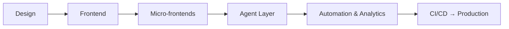

<!-- AI 修改: 本文件由 OpenCode AI（ChatGPT）协助优化，标记：AI 修改 -->

  
   
  <h1>Davy Chen — Code with Curiosity</h1>
  
Frontend artisan • Micro-frontend architect • LLM & multi-agent explorer

---

  
  
  
  
  

---

> If you skim only one line: I turn curiosity into reliable systems — beautiful frontends, scalable micro-frontends, and intelligent agents that automate meaningful work.

---

## Quick Pitch

- 9+ years building web products; started at the UI layer and now build systems that connect UI, infra, and ML.
- Focus: React/Next.js, micro-frontends, Node APIs, CI/CD, and LLM-driven agents.
- Current obsession: multi-agent workflows that stitch tools and humans together.

---

## What I Build

- Frontend experiences that feel thoughtful and fast.
- Micro-frontend platforms that make teams move independently and ship safely.
- Agent-based tools that automate repetitive workflows and surface insights.

---

## Tech Snapshot

  

---

## Playground (Idea Map)

```mermaid
graph LR
  A[Design] --> B[Frontend]
  B --> C[Micro-frontends]
  C --> D[Agent Layer]
  D --> E[Automation & Analytics]
  E --> F[CI/CD → Production]
```

---

## Selected Focus Areas

- LLM-powered multi-agent orchestration (experiments, reproducible patterns)
- Modular frontend ecosystems (micro-frontends, federation, runtime composition)
- Developer experience & delivery (GitHub Actions, observability, testing)

---

## A Few Principles I Care About

- Make the fast path delightful and the safe path dependable.
- Automate boring decisions, let humans focus where they matter.
- Prefer readable, testable code over clever shortcuts.

---

## How to Explore My Work

- Check my pinned repositories on my GitHub profile for small, focused projects.
- I write experiments and notes in repos — look for names like *crewai*, *langgraph*, or anything with *microfront* in the title.

---

## Connect

---

  <small>“Stay curious. Code boldly. Automate wisely.”</small>
   
  <em>这个 README 已由 AI 协助优化 — 标记：AI 修改</em>

