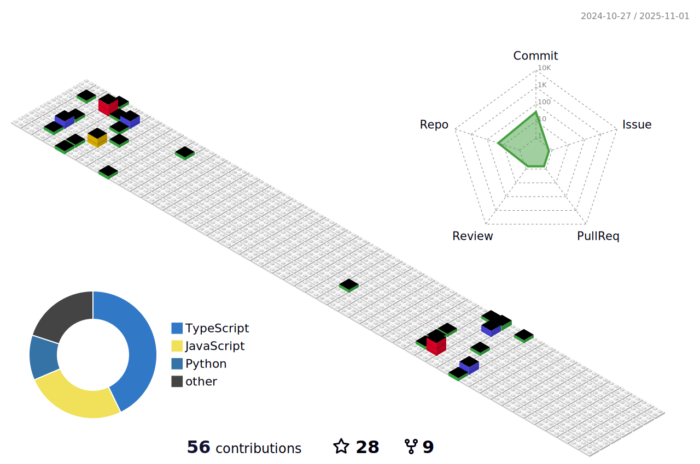

### Hi there 👋
## I'm davy👋
I have over 7 years of development experience, primarily focused on web technologies. I have a wealth of React, React Native, and Vue development experience, as well as expertise in micro-frontends. In the Node.js domain, I have worked with Next.js, Hapi.js, and Koa.js – with Next.js providing SSR support, and Hapi.js and Koa.js following a pure RESTful API style.

I pay great attention to code quality in both front-end and back-end development, incorporating linting tools and adequate unit testing into my projects. For APIs, I have integrated testing experience, and I have also worked with end-to-end testing, implementing automated testing processes using Puppeteer and Cypress.

In one of my recent projects, I gained experience in user behavior tracking by utilizing Adobe Analytics and GA + GTM for capturing user actions. I have a basic understanding of NFT development. For CI/CD, I have used GitHub Actions and GitLab CI to set up conventional continuous integration and deployment processes.

I am well-versed in Agile project management, as all of my projects have followed the Agile methodology. I frequently serve as a key developer in projects, directly communicating with clients to gather requirements, conduct technical research, and present my findings to the clients, consistently receiving positive feedback.

